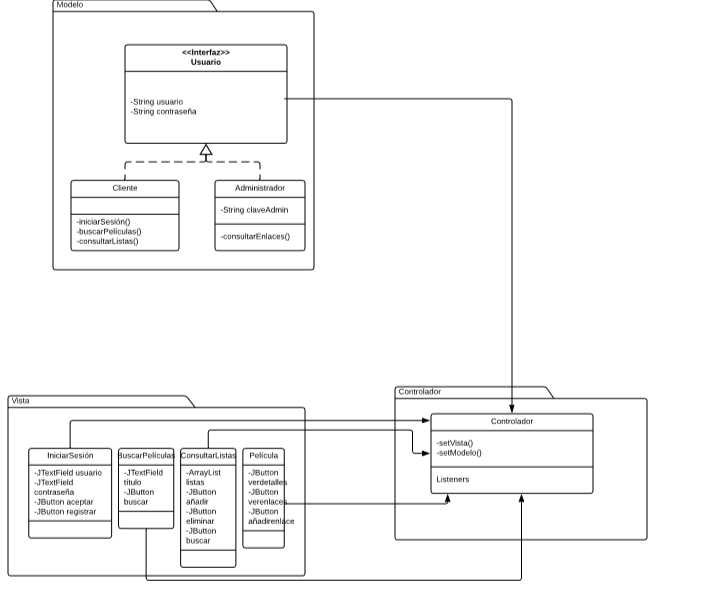
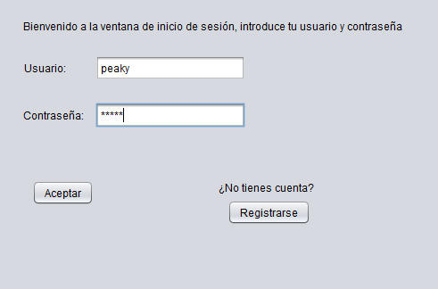
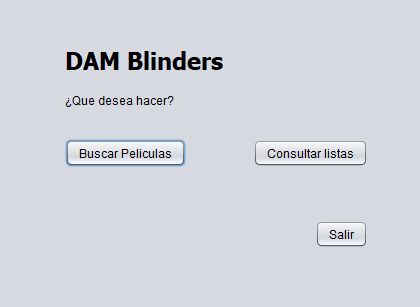

# Actividad 1: Definición del problema. Requisitos funcionales.
# Gestión de un videoclub online DAM Blinders

Nuestro proyecto consistirá sobre la gestión de un videoclub, este programa tendrá las siguientes opciones:
<ul>
  <li>
    <b>Registro de usuarios:</b> Consiste en un formulario que rellenarán los usuarios que quieran registrarse,
    el cual da acceso a las siguientes funcionalidades. En el formulario se requerirán los siguientes datos sobre
    el usuario (nombre,DNI,teléfono,email,dirección,gustos).
  </li>
  <li>
    <b>Iniciar sesión:</b> Para iniciar sesión tiene que haberse registrado previamente e introducir su nombre de usuario y 
    contraseña.
  </li>
  <li>
    <b>Consultar lista:</b> El usuario al presionar en consultar lista accederá a las listas donde haya añadido algo.
  </li>
  <li>
    <b>Ver detalles:</b> Cuando el usuario pulsa en ver detalles se le mostrará una descripción del argumento de la película o
    serie y también los enlaces para verlas
  </li>
  <li>
    <b>Reproducir:</b> La película o serie comienza a reproducirse.
  </li>
  <li>
    <b>Añadir enlaces:</b> Se le abre una ventana que le permite añadir un enlace al usuario.
  </li>
  <li>
    <b>Añadir a lista:</b> Cuando el usuario pulsa en añadir a lista, se añade la película o serie que ha buscado a una lista ya
    existente o se le permite crear una nueva lista.
  </li>
  <li>
    <b>Buscador de películas y/o series:</b> El usuario introduce el nombre de la película o serie que quiere ver y se mostrarán
    los resultados de su búsqueda.
  </li>
  <li>
    <b>Ver enlaces:</b> En este apartado tendremos varios links para ver películas y series online. 
  </li>
  <li>
    <b>Lista de películas y series:</b> Puedes añadir series y película a listas (pendientes,siguiendo,vistas y género)
    a las cuales se podrá acceder. En caso de género saldrán las películas que pertenecen a ese género.
  </li>
  <li>
    <b>Comprobar borradores:</b> El administrador puede consultar los distintos enlaces añadidos por los usuarios y evaluarlos.
    En caso de que la evaluación sea positiva este enlace será añadido al conjunto de enlaces que pueden utilizar los usuarios.
  </li>
  </ul>
  
  # Actividad 3: Análisis de requisitos funcionales. Casos de uso.
 
<table style="width:100%">
  <tr>
    <td><b>ID: </b></td>
    <td>CU-1</td>
  </tr>
  <tr>
    <td><b>Nombre: </b></td>
    <td>Registro de usuario.</td>
  </tr>
  <tr>
    <td><b>Descripción:</b></td>
    <td>El sistema le solicita datos mediante un formulario que el usuario debe rellenar con datos.</td>
    
  </tr>
  <tr>
    <td><b>Actores:</b></td>
    <td>Usuario.</td>
  </tr>
  <tr>
  <td><b>Precondiciones:</b></td>
  <td>Nada.</td>
  </tr>
    <tr>
  <td><b>Curso normal del caso de uso:</b></td>
  <td>1-El usuario selecciona registrarse. 
  2-El sistema le devuelve un formulario(Nombre,Apellidos,Edad,Nombre de usuario y Contraseña) que debe rellenar. 
  3-El cliente introduce los datos correctamente. 
  </td>
  </tr>
  <tr>
  <td><b>Postcondiciones:</b></td>
  <td>El sistema le muestra un mensaje diciendo que el usuario ha sido registrado. 
  </td>
</td>
  </tr>
  <tr>
  <td><b>Alternativas/Excepciones:</b></td>
  <td>Ninguna.</td>
    
</table>
<table style="width:100%">
  <tr>
    <td><b>ID: </b></td>
    <td>CU-2</td>
  </tr>
  <tr>
    <td><b>Nombre: </b></td>
    <td>Inicio de sesión.</td>
  </tr>
  <tr>
    <td><b>Descripción:</b></td>
    <td>El usuario, si ya posee una cuenta, introduce su nombre de usuario y su contraseña y accedera a su perfil previamente   
      personalizado.</td>
  </tr>
  <tr>
    <td><b>Actores:</b></td>
    <td>Usuario.</td>
  </tr>
  <tr>
  <td><b>Precondiciones:</b></td>
  <td>El usuario debe estar registrado en el sistema.</td>
  </tr>
    <tr>
  <td><b>Curso normal del caso de uso:</b></td>
  <td>1- El sistema requerirá del usuario que introduzca su usuario y contraseña. 
  2-El sistema recoge la informacion y comprueba que esta esté previamente registrada en la base de datos de usuarios. 
 
  </td>
  </tr>
  <tr>
  <td><b>Postcondiciones:</b></td>
  <td>El usuario accede satisfactoriamente al sistema y este le da acceso a Buscar Película y Consulta Lista. 
  </td>
</td>
  </tr>
    <tr>
  <td><b>Alternativas/Excepciones:</b></td>
  <td>2.1 El sistema devuele un error al no ser correctos o al no existir los datos introducidos por el usuario y sugiere la opción
    de crear usuario.
 
</td>
  </tr>
</table>
<table style="width:100%">
  <tr>
    <td><b>ID: </b></td>
    <td>CU-3</td>
  </tr>
  <tr>
    <td><b>Nombre: </b></td>
    <td>Consultar listas.</td>
  </tr>
  <tr>
    <td><b>Descripción:</b></td>
    <td>Al usuario se le muestran todas las listas de películas que tiene.</td>
  </tr> 
  <tr>
    <td><b>Actores:</b></td>
    <td>Usuario.</td>
  </tr>
  <tr>
  <td><b>Precondiciones:</b></td>
  <td>El usuario haya iniciado sesión.</td>
  </tr>
    <tr>
  <td><b>Curso normal del caso de uso:</b></td>
  <td>1-El usuario selecciona la opción consultar listas.  
  2-El sistema muestra las listas del usuario.  
  3-El usuario selecciona la lista que quiere consultar o añadir.
</td>
  </tr>
    <tr>
  <td><b>Postcondiciones:</b></td>
  <td>El usuario puede consultar la lista que haya seleccionado.</td>
  </tr>
  <tr>
    <td><b>Alternativas/Excepciones</b></td>
    <td>Nada.</td>
  </tr>
    
  </table>

<table style="width:100%">
</table>

  
  <table style="width:100%">
  <tr>
    <td><b>ID: </b></td>
    <td>CU-4</td>
  </tr>
  <tr>
    <td><b>Nombre: </b></td>
    <td>Ver detalles.</td>
  </tr>
  <tr>
    <td><b>Descripción:</b></td>
    <td>Los usuarios que accedan a esta opción podrán ver los distintos detalles de la serie o película que hayan accedido       (Nombre,Dirección,Reparto,etc).</td> 
  </tr>
  <tr>
    <td><b>Actores:</b></td>
    <td>Usuario y administrador</td>
  </tr>
  <tr>
  <td><b>Precondiciones:</b></td>
  <td>El usuario/administrador haya iniciado sesión.</td>
  </tr>
    <tr>
  <td><b>Curso normal del caso de uso:</b></td>
  <td>1-El usuario pulsa en ver detalles. 
      2-El sistema le devuelve los detalles de la película(nombre,actores,director y duración).</td>
  </tr>
  <tr>
    <td><b>Postcondiciones</b></td>
    <td>Ninguna</td>
  </tr>
  <tr>
    <td><b>Alternativas/Excepciones:</b></td>
    <td>Ninguna</td>
  </tr>
  
    
   
  </table>
  
  <table style="width:100%">
  <tr>
    <td><b>ID: </b></td>
    <td>CU-5</td>
  </tr>
  <tr>
    <td><b>Nombre: </b></td>
    <td>Reproducir.</td>
  </tr>
  <tr>
    <td><b>Descripción:</b></td>
    <td>El usuario le da al botón y la película o serie comienza a reproducirse.</td> 
  </tr>
  <tr>
    <td><b>Actores:</b></td>
    <td>Usuario</td>
  </tr>
  <tr>
  <td><b>Precondiciones:</b></td>
  <td>El usuario debe haber iniciado sesión.</td>
  </tr>
    <tr>
  <td><b>Curso normal del caso de uso:</b></td>
  <td>1-El usuario pulsa el botón reproducir. 
     2-La película o serie comienza a reproducirse</td>
  </tr>
  <tr>
    <td><b>Postcondiciones:</b></td>
    <td>Ninguna.</td>
  </tr>
  <tr>
    <td><b>Alternativas/Excepciones:</b></td>
    <td>Ninguna</td>
    <tr>
  </table>
   <table style="width:100%">
  <tr>
    <td><b>ID: </b></td>
    <td>CU-6</td>
  </tr>
  <tr>
    <td><b>Nombre: </b></td>
    <td>Añadir enlace.</td>
  </tr>
  <tr>
    <td><b>Descripción:</b></td>
    <td>El usuario añade un enlace a la pagina.</td> 
  </tr>
  <tr>
    <td><b>Actores:</b></td>
    <td>Usuario</td>
  </tr>
  <tr>
  <td><b>Precondiciones:</b></td>
  <td>El usuario debe haber iniciado sesión.</td>
  </tr>
    <tr>
  <td><b>Curso normal del caso de uso:</b></td>
  <td>1-El usuario añade un enlace. 
  </td>
      
  </tr>
  <tr>
  <td><b>Postcondiciones:</b></td>
  <td>Ninguna.</td>
  </tr>
  <tr>
  <td><b>Alternativas/Excepciones:</b></td>
  <td>Ninguna.</td>
  </tr>
  
  </table>
  
<table style="width:100%">
  <tr>
    <td><b>ID: </b></td>
    <td>CU-7</td>
  </tr>
  <tr>
    <td><b>Nombre: </b></td>
    <td>Añadir a lista.</td>
  </tr>
  <tr>
    <td><b>Descripción:</b></td>
    <td>El usuario selecciona una película y decide introducirla en la lista que desee.</td>
  </tr>
  <tr>
    <td><b>Actores:</b></td>
    <td>Usuario.</td>
  </tr>
  <tr>
  <td><b>Precondiciones:</b></td>
  <td>El usuario debe haber iniciado sesión.</td>
  </tr>
    <tr>
  <td><b>Curso normal del caso de uso:</b></td>
  <td>
    1-El usuario añade la película a una lista existente. 
   
</td>
  </tr>
  <td><b>Postcondiciónes:</b></td>
  <td>
    Se añade a las listas de películas/series las cuales tiene almacenadas el usuario la nueva película/serie seleccionada.
</td>
  </tr>
    <tr>
  <td><b>Alternativas/Excepciones:</b></td>
  <td>Ninguna.
</td>
  </tr>
</table>

  <table style="width:100%">
  <tr>
    <td><b>ID: </b></td>
    <td>CU-8</td>
  </tr>
  <tr>
    <td><b>Nombre: </b></td>
    <td>Buscador de películas y/o series.</td>
  </tr>
  <tr>
    <td><b>Descripción:</b></td>
    <td>Menú en el cual el cliente podrá realizar la búsqueda de películas y series por la introducción del nombre.</td>
  </tr>
  <tr>
    <td><b>Actores:</b></td>
    <td>Usuario y administrador.</td>
  </tr>
  <tr>
  <td><b>Precondiciones:</b></td>
  <td>El usuario/administrador debe haber iniciado sesión.</td>
  </tr>
    <tr>
  <td><b>Curso normal del caso de uso:</b></td>
  <td>1-El usuario selecciona la barra de buscador.  
  2-Introduce el nombre de la película en la barra del buscador.  
  3- El sistema devuelve la película con el nombre que ha introducido el usuario en el buscador. 
</td>
  </tr>
    <tr>
  <td><b>Postcondiciónes:</b></td>
  <td>La plataforma muestra las diferentes peliculas que coincidan con el nombre previamente introducido.</td>
  </tr>
    <tr>
  <td><b>Alternativas/Excepciones:</b></td>
  <td>2.1-El nombre de la película/serie previamente introducido no coincide con ninguna película/serie registrada en el servidor.</td>
  </tr>
  </table>

<table style="width:100%">
  <tr>
    <td><b>ID: </b></td>
    <td>CU-9</td>
  </tr>
  <tr>
    <td><b>Nombre: </b></td>
    <td>Comprobar borradores.</td>
  </tr>
  <tr>
    <td><b>Descripción:</b></td>
    <td>Se muestran una serie de enlaces al administrador que debe ir catalogando.</td> 
  </tr>
  <tr>
    <td><b>Actores:</b></td>
    <td>Administrador.</td>
  </tr>
  <tr>
  <td><b>Precondiciones:</b></td>
  <td>El administrador debe haber iniciado sesión.</td>
  </tr>
    <tr>
  <td><b>Curso normal del caso de uso:</b></td>
  <td>1-El administrador selecciona la opción comprobar borradores. 
      2-El sistema le muestra una serie de enlaces que han subido los usuarios. 
      3-El administrador clasifica el enlace en función de la calidad de imagen, la pagina de la cual proviene ,el idioma y lo añade.</td>
  </tr>
  <tr>
    <td><b>Postcondiciones:</b></td>
    <td>Ninguna.</td>
  </tr>
  <tr>
    <td><b>Alternativas/Excepciones:</b></td>
    <td>3.1-El administrador considera que el enlace no es apropiado y decide no subirlo.</td>
  </tr>
  </table>

 

# Actividad 4

# Diagrama de clases

  
  

 
# Diagrama de entidad-relación

  
  

            
# Actividad 5: Actividad Gráfica

# Fase 2 Actividad 2: Hilos
