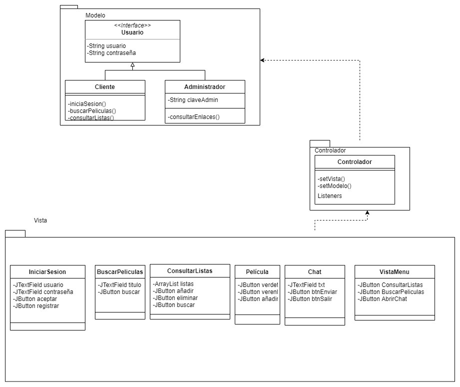
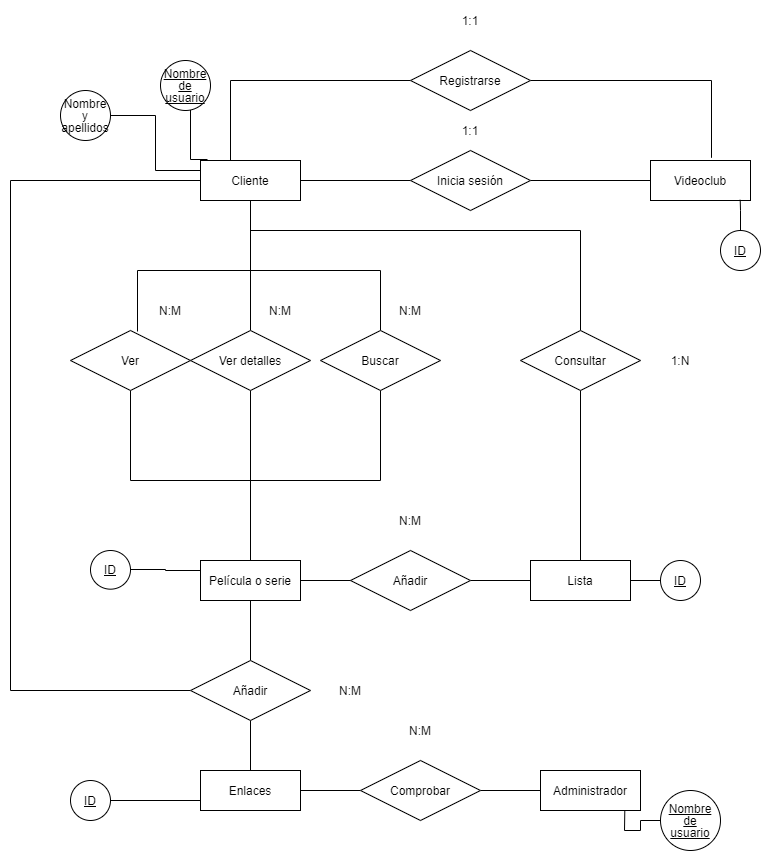
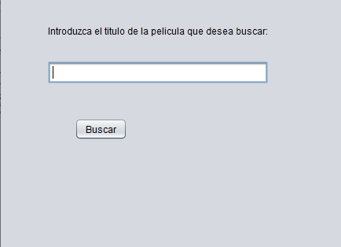
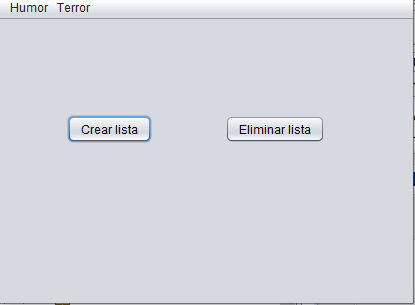
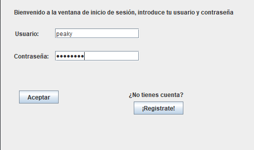
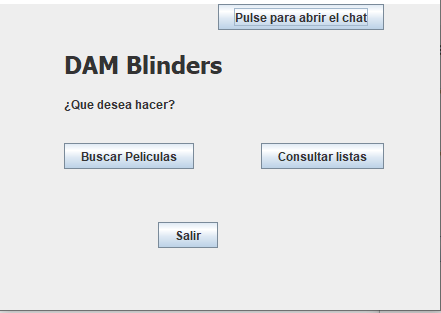
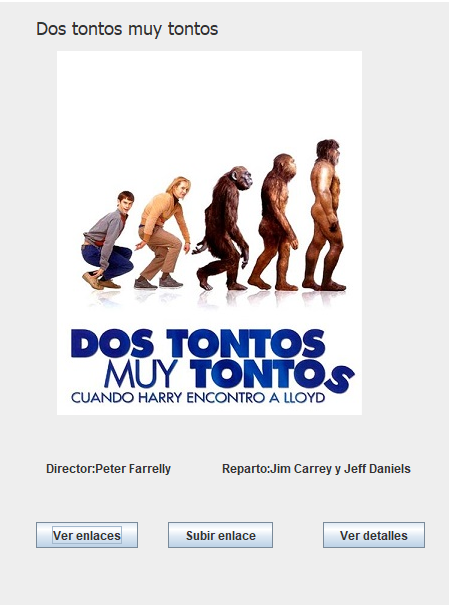
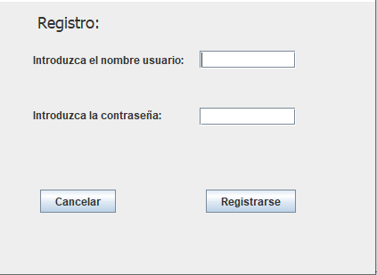
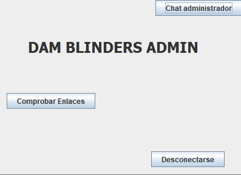

# 
DAM BLINDERS

### 
DAMB: Gestión de videoclub online

#### Autor  
&nbsp;&nbsp;&nbsp;  Este material ha sido desarrollado por <b>Miguel Rodríguez</b> y <b>Victor Lopez</b> bajo licencia Creative Commons:    

 
 

# 
Índice:

> **[Fase 1: Actividad 1](#1)**
>
> **[Fase 1: Actividad 3](#2)**
>
> **[Fase 1: Actividad 4](#3)**
>
> **[Fase 1: Actividad 5](#4)**
>
> **[Fase 2: Actividad 2](#5)**
>
> **[Fase 2: Actividad 3](#6)**
 
 
<a name="1">
  
# Actividad 1: Definición del problema. Requisitos funcionales.
# Gestión de un videoclub online DAM Blinders

Nuestro proyecto consistirá sobre la gestión de un videoclub. Este programa tendrá las siguientes opciones:
<ul>
  <li>
    <b>Registro de usuarios:</b> Consiste en un formulario que rellenarán los usuarios que quieran registrarse,
    el cual da acceso a las siguientes funcionalidades. En el formulario se requerirán los siguientes datos sobre
    el usuario (nombre,DNI,teléfono,email,dirección,gustos).
  </li>
  <li>
    <b>Iniciar sesión:</b> Para iniciar sesión tiene que haberse registrado previamente e introducir su nombre de usuario y 
    contraseña.
  </li>
  <li>
    <b>Consultar lista:</b> El usuario al presionar en consultar lista accederá a las listas donde haya añadido algo.
  </li>
  <li>
    <b>Ver detalles:</b> Cuando el usuario pulsa en ver detalles se le mostrará una descripción del argumento de la película o
    serie y también los enlaces para verlas
  </li>
  <li>
    <b>Reproducir:</b> La película o serie comienza a reproducirse.
  </li>
  <li>
    <b>Añadir enlaces:</b> Se le abre una ventana que le permite añadir un enlace al usuario.
  </li>
  <li>
    <b>Añadir a lista:</b> Cuando el usuario pulsa en añadir a lista, se añade la película o serie que ha buscado a una lista ya
    existente o se le permite crear una nueva lista.
  </li>
  <li>
    <b>Buscador de películas y/o series:</b> El usuario introduce el nombre de la película o serie que quiere ver y se mostrarán
    los resultados de su búsqueda.
  </li>
  <li>
    <b>Ver enlaces:</b> En este apartado tendremos varios links para ver películas y series online. 
  </li>
  <li>
    <b>Lista de películas y series:</b> Puedes añadir series y película a listas (pendientes,siguiendo,vistas y género)
    a las cuales se podrá acceder. En caso de género saldrán las películas que pertenecen a ese género.
  </li>
  <li>
    <b>Comprobar borradores:</b> El administrador puede consultar los distintos enlaces añadidos por los usuarios y evaluarlos.
    En caso de que la evaluación sea positiva este enlace será añadido al conjunto de enlaces que pueden utilizar los usuarios.
  </li>
  </ul>
  </a>
  <a name="2">
  
  # Actividad 3: Análisis de requisitos funcionales. Casos de uso.
 
<table style="width:100%">
  <tr>
    <td><b>ID: </b></td>
    <td>CU-1</td>
  </tr>
  <tr>
    <td><b>Nombre: </b></td>
    <td>Registro de usuario.</td>
  </tr>
  <tr>
    <td><b>Descripción:</b></td>
    <td>El sistema le solicita datos mediante un formulario que el usuario debe rellenar con datos.</td>
    
  </tr>
  <tr>
    <td><b>Actores:</b></td>
    <td>Usuario.</td>
  </tr>
  <tr>
  <td><b>Precondiciones:</b></td>
  <td>Nada.</td>
  </tr>
    <tr>
  <td><b>Curso normal del caso de uso:</b></td>
  <td>1-El usuario selecciona registrarse. 
  2-El sistema le devuelve un formulario(Nombre,Apellidos,Edad,Nombre de usuario y Contraseña) que debe rellenar. 
  3-El cliente introduce los datos correctamente. 
  </td>
  </tr>
  <tr>
  <td><b>Postcondiciones:</b></td>
  <td>El sistema le muestra un mensaje diciendo que el usuario ha sido registrado. 
  </td>
</td>
  </tr>
  <tr>
  <td><b>Alternativas/Excepciones:</b></td>
  <td>Ninguna.</td>
    
</table>
<table style="width:100%">
  <tr>
    <td><b>ID: </b></td>
    <td>CU-2</td>
  </tr>
  <tr>
    <td><b>Nombre: </b></td>
    <td>Inicio de sesión.</td>
  </tr>
  <tr>
    <td><b>Descripción:</b></td>
    <td>El usuario, si ya posee una cuenta, introduce su nombre de usuario y su contraseña y accedera a su perfil previamente   
      personalizado.</td>
  </tr>
  <tr>
    <td><b>Actores:</b></td>
    <td>Usuario.</td>
  </tr>
  <tr>
  <td><b>Precondiciones:</b></td>
  <td>El usuario debe estar registrado en el sistema.</td>
  </tr>
    <tr>
  <td><b>Curso normal del caso de uso:</b></td>
  <td>1- El sistema requerirá del usuario que introduzca su usuario y contraseña. 
  2-El sistema recoge la informacion y comprueba que esta esté previamente registrada en la base de datos de usuarios. 
 
  </td>
  </tr>
  <tr>
  <td><b>Postcondiciones:</b></td>
  <td>El usuario accede satisfactoriamente al sistema y este le da acceso a Buscar Película y Consulta Lista. 
  </td>
</td>
  </tr>
    <tr>
  <td><b>Alternativas/Excepciones:</b></td>
  <td>2.1 El sistema devuele un error al no ser correctos o al no existir los datos introducidos por el usuario y sugiere la opción
    de crear usuario.
 
</td>
  </tr>
</table>
<table style="width:100%">
  <tr>
    <td><b>ID: </b></td>
    <td>CU-3</td>
  </tr>
  <tr>
    <td><b>Nombre: </b></td>
    <td>Consultar listas.</td>
  </tr>
  <tr>
    <td><b>Descripción:</b></td>
    <td>Al usuario se le muestran todas las listas de películas que tiene.</td>
  </tr> 
  <tr>
    <td><b>Actores:</b></td>
    <td>Usuario.</td>
  </tr>
  <tr>
  <td><b>Precondiciones:</b></td>
  <td>El usuario haya iniciado sesión.</td>
  </tr>
    <tr>
  <td><b>Curso normal del caso de uso:</b></td>
  <td>1-El usuario selecciona la opción consultar listas.  
  2-El sistema muestra las listas del usuario.  
  3-El usuario selecciona la lista que quiere consultar o añadir.
</td>
  </tr>
    <tr>
  <td><b>Postcondiciones:</b></td>
  <td>El usuario puede consultar la lista que haya seleccionado.</td>
  </tr>
  <tr>
    <td><b>Alternativas/Excepciones</b></td>
    <td>Nada.</td>
  </tr>
    
  </table>

<table style="width:100%">
</table>

  
  <table style="width:100%">
  <tr>
    <td><b>ID: </b></td>
    <td>CU-4</td>
  </tr>
  <tr>
    <td><b>Nombre: </b></td>
    <td>Ver detalles.</td>
  </tr>
  <tr>
    <td><b>Descripción:</b></td>
    <td>Los usuarios que accedan a esta opción podrán ver los distintos detalles de la serie o película que hayan accedido       (Nombre,Dirección,Reparto,etc).</td> 
  </tr>
  <tr>
    <td><b>Actores:</b></td>
    <td>Usuario y administrador</td>
  </tr>
  <tr>
  <td><b>Precondiciones:</b></td>
  <td>El usuario/administrador haya iniciado sesión.</td>
  </tr>
    <tr>
  <td><b>Curso normal del caso de uso:</b></td>
  <td>1-El usuario pulsa en ver detalles. 
      2-El sistema le devuelve los detalles de la película(nombre,actores,director y duración).</td>
  </tr>
  <tr>
    <td><b>Postcondiciones</b></td>
    <td>Ninguna</td>
  </tr>
  <tr>
    <td><b>Alternativas/Excepciones:</b></td>
    <td>Ninguna</td>
  </tr>
  
    
   
  </table>
  
  <table style="width:100%">
  <tr>
    <td><b>ID: </b></td>
    <td>CU-5</td>
  </tr>
  <tr>
    <td><b>Nombre: </b></td>
    <td>Reproducir.</td>
  </tr>
  <tr>
    <td><b>Descripción:</b></td>
    <td>El usuario le da al botón y la película o serie comienza a reproducirse.</td> 
  </tr>
  <tr>
    <td><b>Actores:</b></td>
    <td>Usuario</td>
  </tr>
  <tr>
  <td><b>Precondiciones:</b></td>
  <td>El usuario debe haber iniciado sesión.</td>
  </tr>
    <tr>
  <td><b>Curso normal del caso de uso:</b></td>
  <td>1-El usuario pulsa el botón reproducir. 
     2-La película o serie comienza a reproducirse</td>
  </tr>
  <tr>
    <td><b>Postcondiciones:</b></td>
    <td>Ninguna.</td>
  </tr>
  <tr>
    <td><b>Alternativas/Excepciones:</b></td>
    <td>Ninguna</td>
    <tr>
  </table>
   <table style="width:100%">
  <tr>
    <td><b>ID: </b></td>
    <td>CU-6</td>
  </tr>
  <tr>
    <td><b>Nombre: </b></td>
    <td>Añadir enlace.</td>
  </tr>
  <tr>
    <td><b>Descripción:</b></td>
    <td>El usuario añade un enlace a la pagina.</td> 
  </tr>
  <tr>
    <td><b>Actores:</b></td>
    <td>Usuario</td>
  </tr>
  <tr>
  <td><b>Precondiciones:</b></td>
  <td>El usuario debe haber iniciado sesión.</td>
  </tr>
    <tr>
  <td><b>Curso normal del caso de uso:</b></td>
  <td>1-El usuario añade un enlace. 
  </td>
      
  </tr>
  <tr>
  <td><b>Postcondiciones:</b></td>
  <td>Ninguna.</td>
  </tr>
  <tr>
  <td><b>Alternativas/Excepciones:</b></td>
  <td>Ninguna.</td>
  </tr>
  
  </table>
  
<table style="width:100%">
  <tr>
    <td><b>ID: </b></td>
    <td>CU-7</td>
  </tr>
  <tr>
    <td><b>Nombre: </b></td>
    <td>Añadir a lista.</td>
  </tr>
  <tr>
    <td><b>Descripción:</b></td>
    <td>El usuario selecciona una película y decide introducirla en la lista que desee.</td>
  </tr>
  <tr>
    <td><b>Actores:</b></td>
    <td>Usuario.</td>
  </tr>
  <tr>
  <td><b>Precondiciones:</b></td>
  <td>El usuario debe haber iniciado sesión.</td>
  </tr>
    <tr>
  <td><b>Curso normal del caso de uso:</b></td>
  <td>
    1-El usuario añade la película a una lista existente. 
   
</td>
  </tr>
  <td><b>Postcondiciónes:</b></td>
  <td>
    Se añade a las listas de películas/series las cuales tiene almacenadas el usuario la nueva película/serie seleccionada.
</td>
  </tr>
    <tr>
  <td><b>Alternativas/Excepciones:</b></td>
  <td>Ninguna.
</td>
  </tr>
</table>

  <table style="width:100%">
  <tr>
    <td><b>ID: </b></td>
    <td>CU-8</td>
  </tr>
  <tr>
    <td><b>Nombre: </b></td>
    <td>Buscador de películas y/o series.</td>
  </tr>
  <tr>
    <td><b>Descripción:</b></td>
    <td>Menú en el cual el cliente podrá realizar la búsqueda de películas y series por la introducción del nombre.</td>
  </tr>
  <tr>
    <td><b>Actores:</b></td>
    <td>Usuario y administrador.</td>
  </tr>
  <tr>
  <td><b>Precondiciones:</b></td>
  <td>El usuario/administrador debe haber iniciado sesión.</td>
  </tr>
    <tr>
  <td><b>Curso normal del caso de uso:</b></td>
  <td>1-El usuario selecciona la barra de buscador.  
  2-Introduce el nombre de la película en la barra del buscador.  
  3- El sistema devuelve una lista con las peliculas o series que coinciden con dicho nombre. 
</td>
  </tr>
    <tr>
  <td><b>Postcondiciónes:</b></td>
  <td>Tendras acceso a ver detalles de dicho contenido o añadirlo a una lista con la que cuentes, como podria ser lista de pendientes.</td>
  </tr>
    <tr>
  <td><b>Alternativas/Excepciones:</b></td>
  <td>2.1-El nombre de la película/serie previamente introducido no coincide con ninguna película/serie registrada en el servidor.</td>
  </tr>
  </table>

<table style="width:100%">
  <tr>
    <td><b>ID: </b></td>
    <td>CU-9</td>
  </tr>
  <tr>
    <td><b>Nombre: </b></td>
    <td>Comprobar borradores.</td>
  </tr>
  <tr>
    <td><b>Descripción:</b></td>
    <td>Se muestran una serie de enlaces al administrador que debe ir catalogando.</td> 
  </tr>
  <tr>
    <td><b>Actores:</b></td>
    <td>Administrador.</td>
  </tr>
  <tr>
  <td><b>Precondiciones:</b></td>
  <td>El administrador debe haber iniciado sesión.</td>
  </tr>
    <tr>
  <td><b>Curso normal del caso de uso:</b></td>
  <td>1-El administrador selecciona la opción comprobar borradores. 
      2-El sistema le muestra una serie de enlaces que han subido los usuarios. 
      3-El administrador clasifica el enlace en función de la calidad de imagen, la pagina de la cual proviene ,el idioma y lo añade.</td>
  </tr>
  <tr>
    <td><b>Postcondiciones:</b></td>
    <td>Ninguna.</td>
  </tr>
  <tr>
    <td><b>Alternativas/Excepciones:</b></td>
    <td>3.1-El administrador considera que el enlace no es apropiado y decide no subirlo.</td>
  </tr>
  </table>
  
  
  <table style="width:100%">
  <tr>
    <td><b>ID: </b></td>
    <td>CU-10</td>
  </tr>
  <tr>
    <td><b>Nombre: </b></td>
    <td>Chat.</td>
  </tr>
  <tr>
    <td><b>Descripción:</b></td>
    <td>El chat permitirá comunicar al cliente con un administrador. Aquí le podrá consultar todo tipo de dudas.</td> 
  </tr>
  <tr>
    <td><b>Actores:</b></td>
    <td>Cliente y Administrador.</td>
  </tr>
  <tr>
  <td><b>Precondiciones:</b></td>
  <td>El administrador y el Cliente deben haber iniciado sesión.</td>
  </tr>
    <tr>
  <td><b>Curso normal del caso de uso:</b></td>
  <td>1-El cliente pulsa el boton "Abrir chat". 
      2-El sistema le muestra una ventana con el chat. 
      3-Sistema notifica al Administrador para que entre al chat. 
      4-El administrador accede al chat pulsando el botón "Abrir chat". 
      5-El cliente consultará sus dudas con el administrador. 
      6-El cliente cierra el chat. </td>
  </tr>
  <tr>
    <td><b>Postcondiciones:</b></td>
    <td>Ninguna.</td>
  </tr>
  <tr>
    <td><b>Alternativas/Excepciones:</b></td>
    <td>Ninguna.</td>
  </tr>
  </table>

 

</a>
<a name="3">

# Actividad 4

# Diagrama de clases

  
  

 
# Diagrama de entidad-relación

  
  

  </a>
   <a name="4"> 
  
# Actividad 5: Actividad Gráfica

  
VistaBuscarPelicula

  
VistaConsultarLista

  
VistaInicioSesion

  
VistaMenu

  
VistaPelicula

  
VistaRegistro

  
  

  

  
VistaMenuAdmin

  
  

</a>
<a name="5">

# Fase 2 Actividad 2: Hilos

El hilo AtenderClientes se encarga de mostrar un mensaje indicando que usuario ha iniciado sesión 
  en nuestra aplicación. Está implementado en la clase AtenderCliente que se encuentra en el paquete controller. 
  Este hilo imprime por pantalla un mensaje indicando el nombre de usuario que acaba de iniciar sesión.

  
  </a>
  <a name="6">
  
# Fase 2 Actividad 3: Red. Análisis y diseño
 <table style="width:100%">
  <tr>
    <td><b>Nombre de la Clase</b></td>
    <td>AtenderCliente</td>
  </tr>
  <tr>
    <td><b>Descripción</b></td>
    <td>Ventana en la cual entablan una conversación cliente-administrador.</td>
  </tr>
  <tr>
    <td><b>Relaciones</b></td>
    <td>Tiene una relación 1:1 con VistaMenu</td> 
  </tr>
  </table>
  <table style="width:100%">
  <tr>
    <td><b>Atributos</b></td>
    <td><b>Explicacion</b></td>
  </tr>
  <tr>
    <td><b>JButton ConsultarListas</b></td>
    <td>El botón ConsultarListas abre la clase ConsultarListas al ser pulsado.
    </td>
  </tr>
  <tr>
    <td><b>JButton BuscarPelículas</b></td>
    <td>El botón BuscarPeliculas abre la claseBuscarPeliculas al ser pulsado.</td> 
  </tr>
   <tr>
     <td><b>JButton AbrirChat</b></td>
    <td>El boton AbrirChat abre la clase Chat al ser pulsado.</td> 
  </tr>
  </table>
   <table style="width:100%">
  <tr>
  <td><b>Sintaxis del método</b></td>
  <td><b>Explicación</b></td>
  </tr>
  <tr>
  <td>Ninguno.</td>
  <td>Ninguno</td>
  </tr>
  </table>
   
   
   
   <table style="width:100%">
  <tr>
    <td><b>Nombre de la Clase</b></td>
    <td>Main</td>
  </tr>
  <tr>
    <td><b>Descripción</b></td>
    <td>Es la clase principal de la aplicación, instancia el controlador y la VistaInicioSesion.</td>
  </tr>
  <tr>
    <td><b>Relaciones</b></td>
    <td>Tiene una relación 1:1 con Controlador y tiene otra relación 1:1 VistaInicioSesion</td> 
  </tr>
  </table>
  <table style="width:100%">
  <tr>
    <td><b>Atributos</b></td>
    <td><b>Explicacion</b></td>
  </tr>
  <tr>
    <td><b>Ninguno.</b></td>
    <td>Ninguno.
    </td>
  </tr>
  </table>
  <table style="width:100%">
  <tr>
  <td><b>Sintaxis del método</b></td>
  <td><b>Explicación</b></td>
  </tr>
  <tr>
  <td>main(String[] args)</td>
  <td>Instancia la clase Controlador y la clase Vista e inicia nuestra aplicación</td>
  </tr>
  </table>
   
   
   
   
   <table style="width:100%">
  <tr>
    <td><b>Nombre de la Clase</b></td>
    <td>Controlador</td>
  </tr>
  <tr>
    <td><b>Descripción</b></td>
    <td>Esta clase se encarga de controlar los diferentes eventos que ocurren en 
  las vistas.</td>
  </tr>
  <tr>
    <td><b>Relaciones</b></td>
    <td>Relacion 1:1 con Model,Pelicula,VistaBuscarPelícula,VistaConsultarLista,VistaInicioSesion,VistaMenu,VistaRegsitro.</td> 
  </tr>
  </table>
  <table style="width:100%">
  <tr>
    <td><b>Atributos</b></td>
    <td><b>Explicacion</b></td>
  </tr>
  <tr>
    <td><b>-VistaInicioSesion view</b></td>
    <td>Este atributo hace referencia a la VistaInicioSesion, para controlar los eventos que ocurren en la misma.</td>
  </tr>
  <tr>
    <td><b>-Model model</b></td>
    <td>Este atributo hace referencia al modelo, que nos permitirá hacer referencia a los métodos para ingresar datos a la base de datos.</td> 
  </tr>
  </table>
    <table style="width:100%">
  <tr>
  <td><b>Sintaxis del método</b></td>
  <td><b>Explicación</b></td>
  </tr>
  <tr>
  <td>setView(VistaInicioSesion view)</td>
  <td>Permite modificar el atributo view</td>
  </tr>
  <tr>
    <td>setModel(Model model)</td>
    <td>Permite modificar el atributo model</td>
  </tr>
  <tr>
    <td>actionPerformed(ActionEvent ae)</td>
    <td>Este método permite capturar los eventos en ae</td>
  </tr>
  </table>
   
   
   
   <table style="width:100%">
  <tr>
    <td><b>Nombre de la Clase</b></td>
    <td>Model</td>
  </tr>
  <tr>
    <td><b>Descripción</b></td>
    <td>La clase modelo nos permite acceder a la base datos.</td>
  </tr>
  <tr>
    <td><b>Relaciones</b></td>
    <td>Relacion 1:1 con la clase Controador y con la clase Main.</td> 
  </tr>
  </table>
  <table style="width:100%">
  <tr>
    <td><b>Atributos</b></td>
    <td><b>Explicacion</b></td>
  </tr>
  <tr>
    <td><b>Ninguno</b></td>
    <td>Ninguno</td>
  </tr>
  
  </table>
     <table style="width:100%">
  <tr>
  <td><b>Sintaxis del método</b></td>
  <td><b>Explicación</b></td>
  </tr>
  <tr>
  <td>Ninguno.</td>
  <td>Ninguno.</td>
  </tr>
  </table>
   
   
   
   <table style="width:100%">
  <tr>
    <td><b>Nombre de la Clase</b></td>
    <td>Pelicula</td>
  </tr>
  <tr>
    <td><b>Descripción</b></td>
    <td>Nos permite visualizar la carátula de la película, la descripcion, el título y el reparto.</td>
  </tr>
  <tr>
    <td><b>Relaciones</b></td>
    <td>Relacion 1:1 con el controlador</td> 
  </tr>
  </table>
  <table style="width:100%">
  <tr>
    <td><b>Atributos</b></td>
    <td><b>Explicacion</b></td>
  </tr>
  <tr>
    <td><b>JButton btnVer</b></td>
    <td>Este boton nos permite ver los enlaces de la Película</td>
  </tr>
  <tr>
    <td><b>JButton btnSubir</b></td>
    <td>Este boton nos permite subir un enlace.</td> 
  </tr>
   <tr>
     <td><b>JButton btnDetalles</b></td>
    <td>Este boton nos permite ver detalles de la película (director,productora,críticas,etc).</td> 
  </tr>
    <tr>
    <td><b>JLabel lblTitulo</b></td>
    <td>Es un label con el título de la película.</td> 
  </tr>
    <tr>
    <td><b>JLabel lblDescripcion</b></td>
    <td>Es un label con la descripcion de la película.</td> 
  </tr>
    <tr>
    <td><b>JLabel lblReparto</b></td>
    <td>Es un label que nos muestra el reparto.</td> 
  </tr>
  </table>
    <table style="width:100%">
  <tr>
  <td><b>Sintaxis del método</b></td>
  <td><b>Explicación</b></td>
  </tr>
  <tr>
  <td>Getters y setters</td>
  <td>Permiten modificar y obtener los atributos</td>
  </tr>
  </table>
   
   
   
  <table style="width:100%">
  <tr>
    <td><b>Nombre de la Clase</b></td>
    <td>VistaBuscarPelícula</td>
  </tr>
  <tr>
    <td><b>Descripción</b></td>
    <td>Es un buscador en el que introducimos el nombre una película.</td>
  </tr>
  <tr>
    <td><b>Relaciones</b></td>
    <td>Relacion 1:1 controlador</td> 
  </tr>
  </table>
  <table style="width:100%">
  <tr>
    <td><b>Atributos</b></td>
    <td><b>Explicacion</b></td>
  </tr>
  <tr>
    <td><b>JButton btnBuscar</b></td>
    <td>Al pulsar el botón se busca en la base de datos una película con ese nombre.</td>
  </tr>
  <tr>
    <td><b>JLabel lblTexto</b></td>
    <td>Es un label con un texto.</td> 
  </tr>
   <tr>
     <td><b>JTextField txtBuscador</b></td>
    <td>En este textfield introduciremos el nombre de la película que queremos buscar.</td> 
  </tr>
  </table>
    <table style="width:100%">
  <tr>
  <td><b>Sintaxis del método</b></td>
  <td><b>Explicación</b></td>
  </tr>
  <tr>
  <td>Getters y Setters.</td>
  <td>Devuelven o modifican los atributos.</td>
  </tr>
  </table>
   
   
   
 <table style="width:100%">
  <tr>
    <td><b>Nombre de la Clase</b></td>
    <td>VistaConsultarLista</td>
  </tr>
  <tr>
    <td><b>Descripción</b></td>
    <td>Se van añadiendo objetos menu conforme se creen nuevas listas, es decir, cuando 
      pulsemos el boton crear lista, también podemos eliminarlas con el botón eliminar.</td>
  </tr>
  <tr>
    <td><b>Relaciones</b></td>
    <td>Relacion 1:1 con el controlador</td> 
  </tr>
  </table>
  <table style="width:100%">
  <tr>
    <td><b>Atributos</b></td>
    <td><b>Explicacion</b></td>
  </tr>
  <tr>
    <td><b>JButton btnCrear</b></td>
    <td>Este botón nos permite crear listas.</td>
  </tr>
  <tr>
    <td><b>JButton btnEliminar</b></td>
    <td>Este botón nos permite eliminar lista.</td> 
  </tr>
   <tr>
     <td><b>jMenu Humor</b></td>
    <td>Es una lista con la lista humor.</td> 
  </tr>
   <tr>
     <td><b>jMenu Terror</b></td>
    <td>Es una lista con la lista humor.</td> 
  </tr>
   <tr>
     <td><b>jMenuItem item1</b></td>
    <td>Cada item nos guarda un objeto película.</td> 
  </tr>
  </table>
    <table style="width:100%">
  <tr>
  <td><b>Sintaxis del método</b></td>
  <td><b>Explicación</b></td>
  </tr>
  <tr>
  <td>Getters y Setters</td>
  <td>Devuelven o modifican los atributos</td>
  </tr>
  </table>
   
   
   
   <table style="width:100%">
  <tr>
    <td><b>Nombre de la Clase</b></td>
    <td>VistaInicioSesion</td>
  </tr>
  <tr>
    <td><b>Descripción</b></td>
    <td>En esta vista podremos iniciar sesión introduciendo nuestro usuario o contraseña. Si no estamos registrados 
      podemos pulsar en el boton Registrarse para registrarnos.</td>
  </tr>
  <tr>
    <td><b>Relaciones</b></td>
    <td>1:1 con el Controlador</td> 
  </tr>
  </table>
  <table style="width:100%">
  <tr>
    <td><b>Atributos</b></td>
    <td><b>Explicacion</b></td>
  </tr>
  <tr>
    <td><b>JTextField txtUsuario</b></td>
    <td>El campo en el que introduciremos nuestro usuario.</td>
  </tr>
  <tr>
    <td><b>JTextField txtContraseña</b></td>
    <td>El campo en el que introduciremos nuestra contraseña.</td> 
  </tr>
   <tr>
     <td><b>JLabel lblUsuario</b></td>
    <td>Nos indica el campo en el que introduciremos el usuario.</td> 
  </tr>
   <tr>
     <td><b>JLabel lblContraseña</b></td>
    <td>Nos indica el campo en el que introduciremos el contraseña.</td> 
  </tr>
   <tr>
     <td><b>JButton btnAceptar</b></td>
    <td>Nos lleva a VistaMenu cuando pulsemos.</td> 
  </tr>
     <tr>
     <td><b>JButton btnRegistrarse</b></td>
    <td>Nos lleva a VistaRegistro cuando pulsemos.</td> 
  </tr>
  
  </table>
    <table style="width:100%">
  <tr>
  <td><b>Sintaxis del método</b></td>
  <td><b>Explicación</b></td>
  </tr>
  <tr>
  <td>Getters y Setters</td>
  <td>Devuelven o modifican los atributos</td>
  </tr>
  </table>
   
   
   
   <table style="width:100%">
  <tr>
    <td><b>Nombre de la Clase</b></td>
    <td>VistaMenu</td>
  </tr>
  <tr>
    <td><b>Descripción</b></td>
    <td>Es un menú con tres botones, "Buscar Peliculas" que nos lleva a VistaBuscarPelicula y el botón "Consultar Listas" 
      que nos lleva a "VistaConsultarLista". También hay un botón salir que nos cerrará el menú.</td>
  </tr>
  <tr>
    <td><b>Relaciones</b></td>
    <td>Relación 1:1 con el controlador</td> 
  </tr>
  </table>
  <table style="width:100%">
  <tr>
    <td><b>Atributos</b></td>
    <td><b>Explicacion</b></td>
  </tr>
  <tr>
    <td><b>JButton btnBuscador</b></td>
    <td>Si lo pulsamos nos lleva a VistaBuscarPelícula</td>
  </tr>
  <tr>
    <td><b>JButton btnConsultarLista</b></td>
    <td>Si lo pulsamos nos lleva a VistaConsultarLista.</td> 
  </tr>
   <tr>
     <td><b>JLabel lbl1</b></td>
    <td>Nos muestra un texto con el nombre de la aplicación.</td> 
  </tr>
   <tr>
     <td><b>JLabel lbl2</b></td>
    <td>Nos muestra un texto que pregunta lo que queremos hacer.</td> 
  </tr>
  </table>
    <table style="width:100%">
  <tr>
  <td><b>Sintaxis del método</b></td>
  <td><b>Explicación</b></td>
  </tr>
  <tr>
  <td>Getters y Setters</td>
  <td>Devuelven o modifican los atributos</td>
  </tr>
  </table>
   
   
   
  <table style="width:100%">
  <tr>
    <td><b>Nombre de la Clase</b></td>
    <td>VistaRegistro</td>
  </tr>
  <tr>
    <td><b>Descripción</b></td>
    <td>Nos permite registrar a un nuevo usuario.</td>
  </tr>
  <tr>
    <td><b>Relaciones</b></td>
    <td>Relacion 1:1 con el controlador</td> 
  </tr>
  </table>
  <table style="width:100%">
  <tr>
    <td><b>Atributos</b></td>
    <td><b>Explicacion</b></td>
  </tr>
  <tr>
    <td><b>JTextField usuario</b></td>
    <td>Introducimos el nombre de usuario que queremos.</td>
  </tr>
  <tr>
    <td><b>JTextField psswd></b></td>
    <td>Introducimos la contraseña que queramos para nuestra cuenta.</td> 
  </tr>
   <tr>
     <td><b>JButton btnAceptar</b></td>
    <td>Cuando lo pulsemos se registrará el usuario en la base de datos y  
      volveremos a VistaInicioSesion.</td> 
  </tr>
  </table>
    <table style="width:100%">
  <tr>
  <td><b>Sintaxis del método</b></td>
  <td><b>Explicación</b></td>
  </tr>
  <tr>
  <td>Getters y Setters</td>
  <td>Devuelven o modifican los atributos</td>
  </tr>
  </table>
  

  
  

  

  
  

  

  
  

  

  
  

  

  
  

  

  
  

  

  
  

  

  
  

 

  
  
 
  </a>
  # Fase 3 Actividad 1: Revisión de la Fase 2
  
   

  
<b>Diagrama de Clases</b>

  
  

  

  
<b>Diagrama de Secuencia</b>

  
  

  
