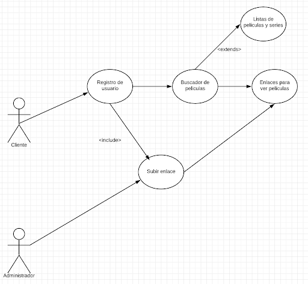

# Actividad 1: Definición del problema. Requisitos funcionales.
# Gestión de un videoclub online DAM Blinders

Nuestro proyecto consistirá sobre la gestión de un videoclub, este programa tendrá las siguientes opciones:
<ul>
  <li>
    <b>Registro de usuarios:</b> Consiste en un formulario que rellenarán los usuarios que quieran registrarse,
    el cual da acceso a las siguientes funcionalidades. En el formulario se requerirán los siguientes datos sobre
    el usuario (nombre,DNI,teléfono,email,dirección,gustos).
  </li>
  <li>
    <b>Iniciar sesión:</b> Para iniciar sesión tiene que haberse registrado previamente e introducir su nombre de usuario y 
    contraseña.
  </li>
  <li>
    <b>Consultar lista:</b> El usuario al presionar en consultar lista accederá a las listas donde haya añadido algo.
  </li>
  <li>
    <b>Ver detalles:</b> Cuando el usuario pulsa en ver detalles se le mostrará una descripción del argumento de la película o
    serie y también los enlaces para verlas
  </li>
  <li>
    <b>Reproducir:</b> La película o serie comienza a reproducirse.
  </li>
  <li>
    <b>Añadir enlaces:</b> Se le abre una ventana que le permite añadir un enlace al usuario.
  </li>
  <li>
    <b>Añadir a lista:</b> Cuando el usuario pulsa en añadir a lista, se añade la película o serie que ha buscado a una lista ya
    existente o se le permite crear una nueva lista.
  </li>
  <li>
    <b>Buscador de películas y/o series:</b> El usuario introduce el nombre de la película o serie que quiere ver y se mostrarán
    los resultados de su búsqueda.
  </li>
  <li>
    <b>Ver enlaces:</b> En este apartado tendremos varios links para ver películas y series online. 
  </li>
  <li>
    <b>Lista de películas y series:</b> Puedes añadir series y película a listas (pendientes,siguiendo,vistas y género)
    a las cuales se podrá acceder. En caso de género saldrán las películas que pertenecen a ese género.
  </li>
  <li>
    <b>Comprobar borradores:</b> El administrador puede consultar los distintos enlaces añadidos por los usuarios y evaluarlos.
    En caso de que la evaluación sea positiva este enlace será añadido al conjunto de enlaces que pueden utilizar los usuarios.
  </li>
  </ul>
  
  # Actividad 3: Análisis de requisitos funcionales. Casos de uso.
 
<table style="width:100%">
  <tr>
    <td><b>Nombre: </b></td>
    <td>Registro de usuario.</td>
  </tr>
  <tr>
    <td><b>Descripción:</b></td>
    <td>El sistema le solicita datos mediante un formulario que el usuario debe rellenar con datos.</td>
    
  </tr>
  <tr>
    <td><b>Actores:</b></td>
    <td>Cliente.</td>
  </tr>
  <tr>
  <td><b>Precondiciones:</b></td>
  <td>Ser mayor de edad.</td>
  </tr>
    <tr>
  <td><b>Curso normal del caso de uso:</b></td>
  <td>1-El cliente selecciona registrarse. 
  2-El sistema le devuelve un formulario que debe rellenar. 
  3-El cliente introduce los datos correctamente. 
  </td>
  </tr>
  <tr>
  <td><b>Postcondiciones:</b></td>
  <td>El sistema le muestra un mensaje diciendo que el usuario ha sido registrado. 
  </td>
</td>
  </tr>
    <tr>
  <td><b>Alternativas/Excepciones:</b></td>
  <td>3.1- El cliente es menor de edad. 
  3.1.2- El sistema devuelve un error indicando que debe ser mayor de edad para registrarse.
</td>
  </tr>
</table>
<table style="width:100%">
  <tr>
    <td><b>Nombre: </b></td>
    <td>Inicio de sesión.</td>
  </tr>
  <tr>
    <td><b>Descripción:</b></td>
    <td>El cliente, si ya posee una cuenta, introduce su nombre de usuario y su contraseña y accedera a su perfil previamente   
      personalizado.</td>
    
  </tr>
  <tr>
    <td><b>Actores:</b></td>
    <td>Cliente.</td>
  </tr>
  <tr>
  <td><b>Precondiciones:</b></td>
  <td>El cliente debe estar registrado en el sistema.</td>
  </tr>
    <tr>
  <td><b>Curso normal del caso de uso:</b></td>
  <td>1- El sistema requerirá del cliente que introduzca su usuario y contraseña. 
  2-El sistema recoge la informacion y comprueba que esta esté previamente registrada en la base de datos de usuarios. 
 
  </td>
  </tr>
  <tr>
  <td><b>Postcondiciones:</b></td>
  <td>El usuario accede satisfactoriamente al sistema. 
  </td>
</td>
  </tr>
    <tr>
  <td><b>Alternativas/Excepciones:</b></td>
  <td>2.1 El sistema devuele un error al no ser correctos o al no existir los datos introducidos por el cliente y sugiere la opción
    de crear usuario.
 
</td>
  </tr>
</table>

<table style="width:100%">
</table>

<table style="width:100%">
  <tr>
    <td><b>Nombre: </b></td>
    <td>Buscador de películas y/o series.</td>
  </tr>
  <tr>
    <td><b>Descripción:</b></td>
    <td>Barra en la cual el cliente podrá realizar la búsqueda de películas y series por la introducción del nombre.</td>
  </tr>
  <tr>
    <td><b>Actores:</b></td>
    <td>Cliente.</td>
  </tr>
  <tr>
  <td><b>Precondiciones:</b></td>
  <td>El cliente esté registrado.</td>
  </tr>
    <tr>
  <td><b>Curso normal del caso de uso:</b></td>
  <td>1-El cliente selecciona la barra de buscador.  
  2-Introduce el nombre de la película en la barra del buscador.    
</td>
  </tr>
    <tr>
  <td><b>Postcondiciónes:</b></td>
  <td>La plataforma muestra las diferentes peliculas que coincidan con el nombre previamente introducido.</td>
  </tr>
    <tr>
  <td><b>Alternativas/Excepciones:</b></td>
  <td>2.1-El nombre de la película/serie previamente introducido no coincide con ninguna película/serie registrada en el servidor.</td>
  </tr>
  </table>

<table style="width:100%">
  <tr>
    <td><b>Nombre: </b></td>
    <td>Enlaces para ver películas.</td>
  </tr>
  <tr>
    <td><b>Descripción:</b></td>
    <td>Después de utilizar el buscador y seleccionar una película o serie aparecerán todos los enlaces.</td>
  </tr>
  <tr>
    <td><b>Actores:</b></td>
    <td>Cliente.</td>
  </tr>
  <tr>
  <td><b>Precondiciones:</b></td>
  <td>El cliente esté registrado.</td>
  </tr>
    <tr>
  <td><b>Curso normal del caso de uso:</b></td>
  <td>1- El cliente utiliza el buscador y selecciona una serie o película. 
      2- Aparecen los enlaces disponibles.
</td>
  </tr>
  </table>

<table style="width:100%">
  <tr>
    <td><b>Nombre: </b></td>
    <td>Subir un enlace a la página.</td>
  </tr>
  <tr>
    <td><b>Descripción:</b></td>
    <td>En la pantalla principal aparece una opción para subir un enlace de una película.</td> 
  </tr>
  <tr>
    <td><b>Actores:</b></td>
    <td>Cliente y administrador.</td>
  </tr>
  <tr>
  <td><b>Precondiciones:</b></td>
  <td>El cliente esté registrado.</td>
  </tr>
    <tr>
  <td><b>Curso normal del caso de uso:</b></td>
  <td>1-El cliente selecciona la opción de subir un enlace e indica a qué película o serie pertenece. 
      2-El administrador evalúa el enlace y lo considera apropiado. 
      3-El enlace es subido.</td>
  </tr>
  <tr>
    <td><b>Alternativas/Excepciones:</b></td>
    <td>2.1-El administrador considera que el enlace no es apropiado y decide no subirlo.</td>
  </tr>
  </table>

 

<table style="width:100%">
  <tr>
    <td><b>Nombre: </b></td>
    <td>Lista de películas y series.</td>
  </tr>
  <tr>
    <td><b>Descripción:</b></td>
    <td>El usuario selecciona una película y decide introducirla en la lista que desee.</td>
  </tr>
  <tr>
    <td><b>Actores:</b></td>
    <td>Cliente.</td>
  </tr>
  <tr>
  <td><b>Precondiciones:</b></td>
  <td>El cliente esté registrado.</td>
  </tr>
    <tr>
  <td><b>Curso normal del caso de uso:</b></td>
  <td>
    1-El cliente busca la película o serie. 
    2-El cliente añade la película a una lista existente.
</td>
  </tr>
  <td><b>Postcondiciónes:</b></td>
  <td>
    Se añade a las listas de películas/series las cuales tiene almacenadas el cliente la nueva película/serie seleccionada.
</td>
  </tr>
    <tr>
  <td><b>Alternativas/Excepciones:</b></td>
  <td>2.1- El cliente crea una nueva lista para añadir la película.
</td>
  </tr>
</table>

 

